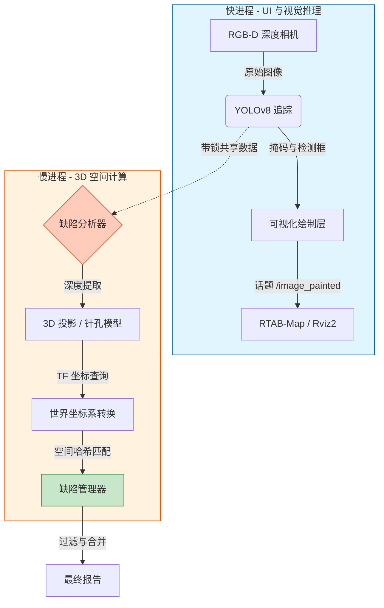

flowchart LR
    Camera[RGB-D 相机] -->|RGB/Depth| FastLoop[fast_processing_loop\nYOLO分割 + 纹理绘制]
    FastLoop -->|/camera/camera/color/image_painted| RTAB[RTAB-Map / RViz2]
    SlowLoop -->|DefectManager| Report[final_report.txt]
