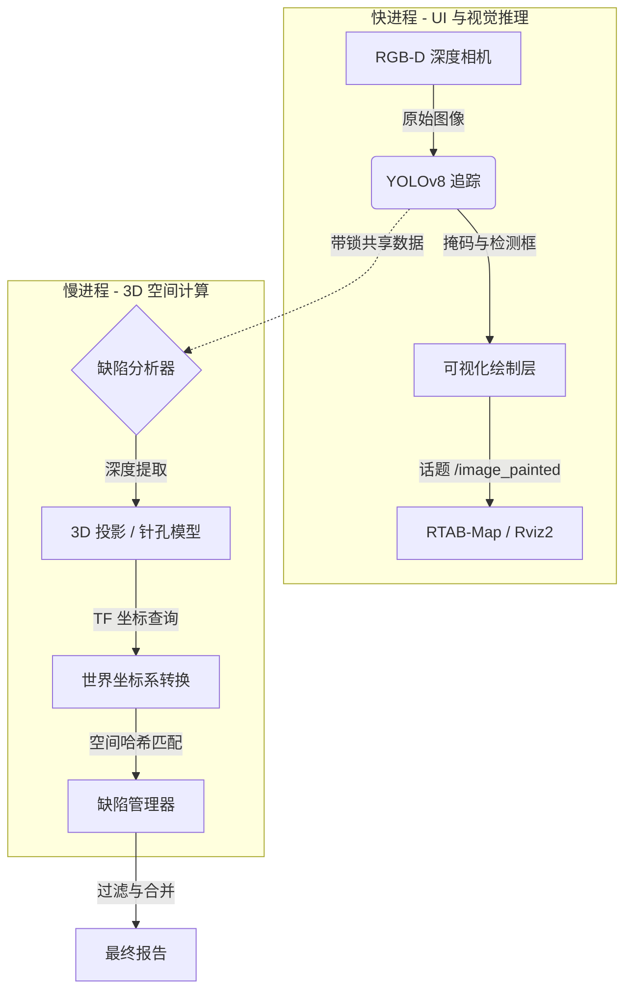
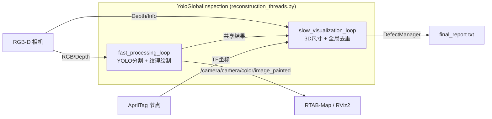

```mermaid
graph TD
    %% 子图定义：快进程 - 负责UI显示与推理，低延迟
    subgraph FastLoop [快进程 - UI 与视觉推理]
        A[RGB-D 深度相机] -->|原始图像| B(YOLOv8 追踪)
        B -->|掩码与检测框| C[可视化绘制层]
        C -->|话题 /image_painted| D[RTAB-Map / Rviz2]
    end
    
    %% 子图定义：慢进程 - 负责繁重的3D运算与去重
    subgraph SlowLoop [慢进程 - 3D 空间计算]
        %% 虚线表示跨线程通信
        B -.->|带锁共享数据| E{缺陷分析器}
        E -->|深度提取| F[3D 投影 / 针孔模型]
        F -->|TF 坐标查询| G[世界坐标系转换]
        G -->|空间哈希匹配| H[缺陷管理器]
    end
    
    %% 最终输出
    H -->|过滤与合并| I[最终报告]

```

```mermaid
flowchart LR
    Camera[RGB-D 相机] -->|RGB/Depth| FastLoop[fast_processing_loop\nYOLO分割 + 纹理绘制]
    Camera -->|Depth/Info| SlowLoop[slow_visualization_loop\n3D尺寸 + 全局去重]

    subgraph YoloNode["YoloGlobalInspection (reconstruction_threads.py)"]
        FastLoop -->|共享结果| SlowLoop
    end

    FastLoop -->|/camera/camera/color/image_painted| RTAB[RTAB-Map / RViz2]
    Tag[AprilTag 节点] -->|TF坐标| SlowLoop
    SlowLoop -->|DefectManager| Report[final_report.txt]
```
